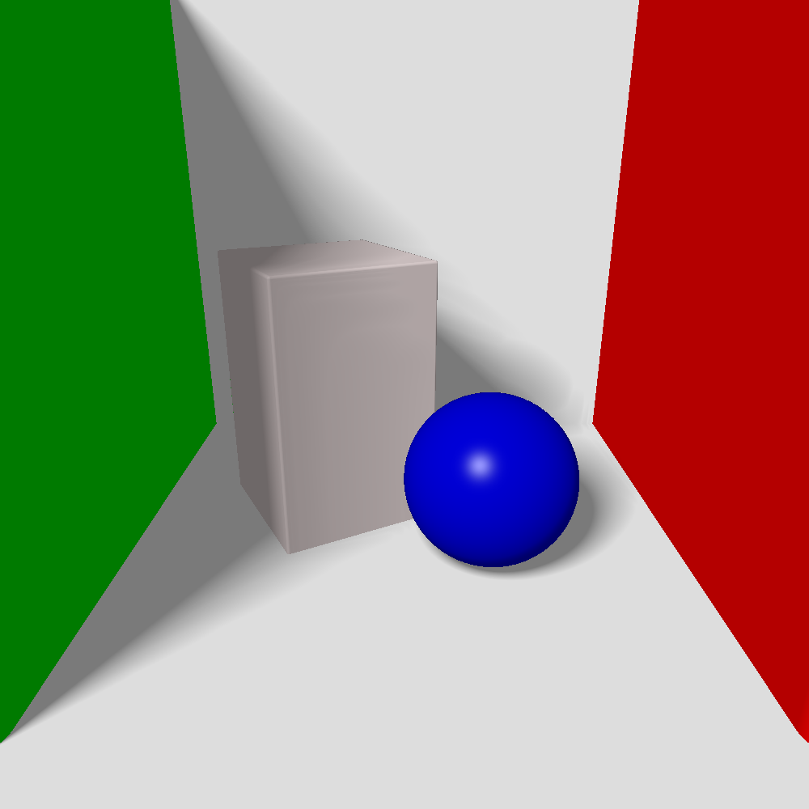
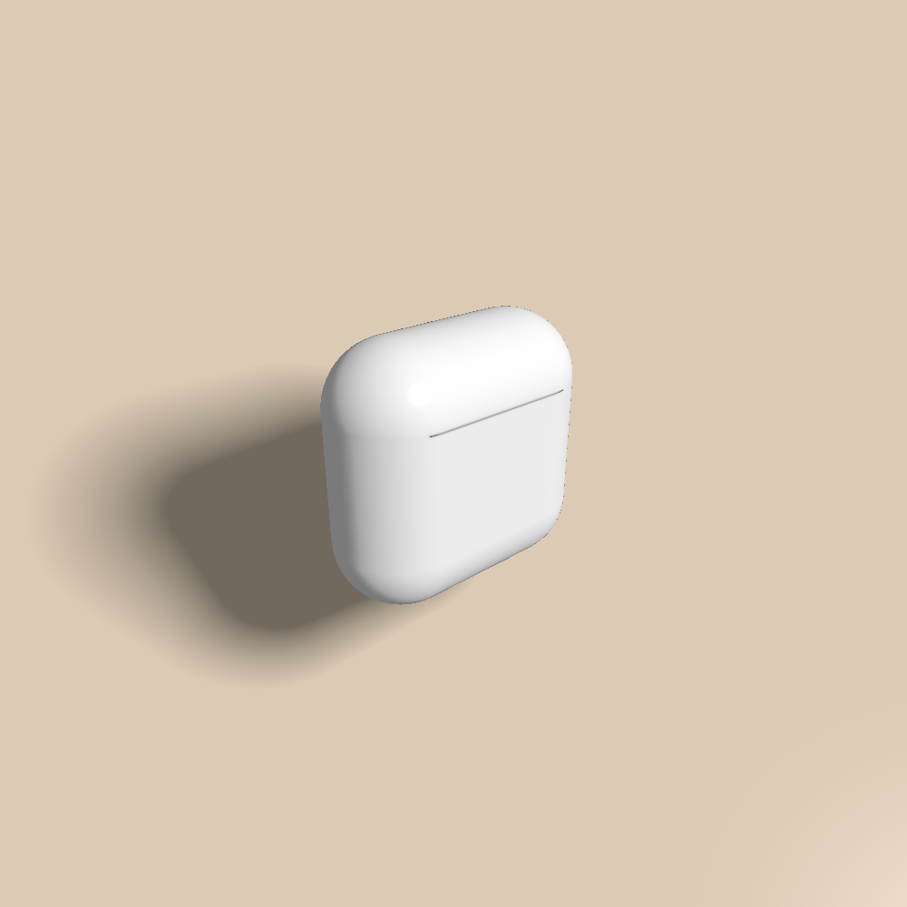
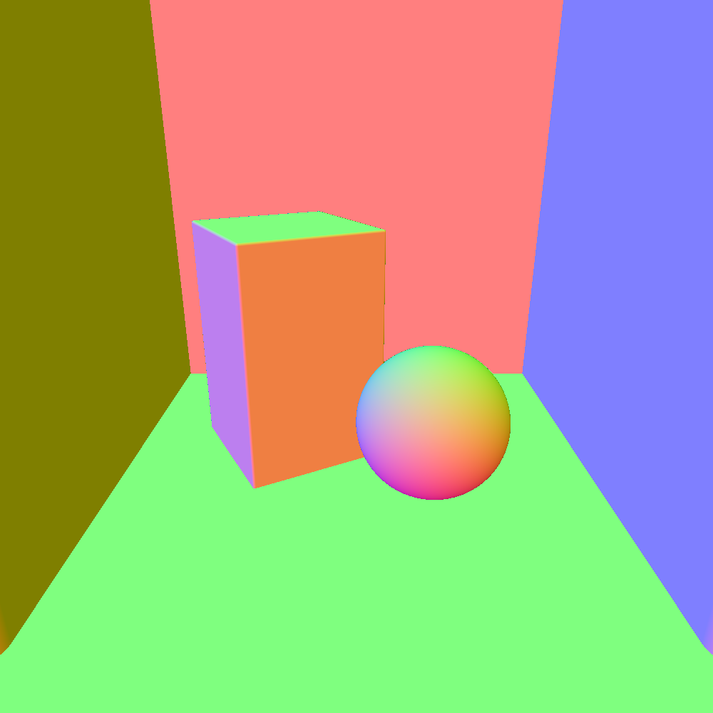
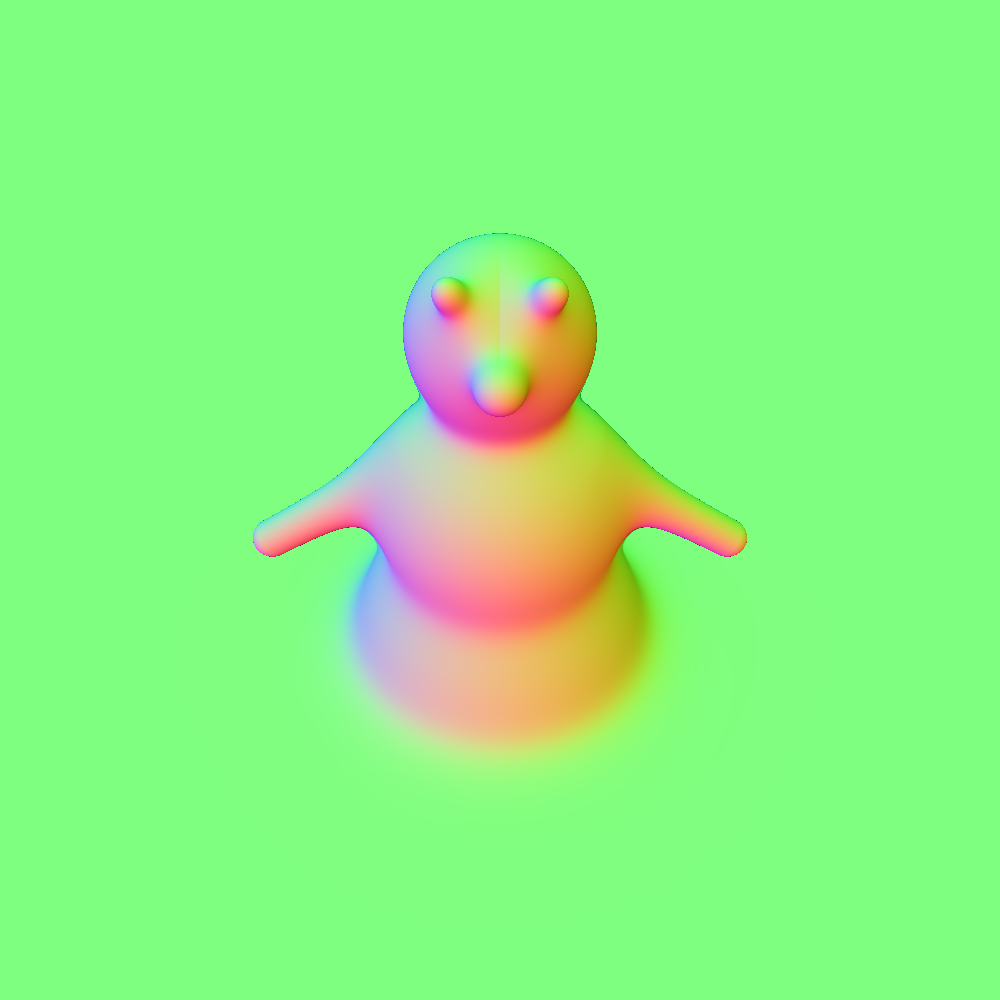
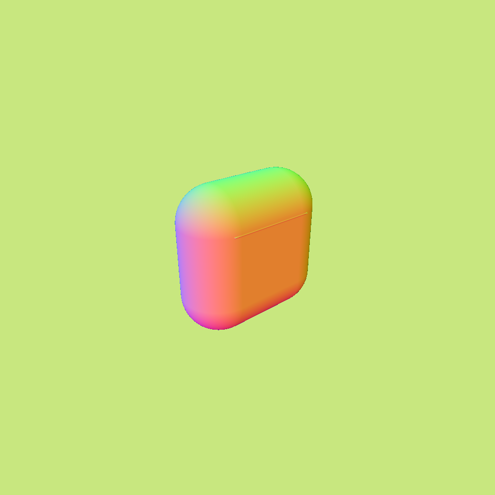

# Raymarching in JAX

Dash app to interact with raymarching in JAX. Toy project to learn about raymarching.

Try it out using colab:

<a href="https://colab.research.google.com/github/albertaillet/render/blob/main/notebooks/colab.ipynb" target="_parent"></a>

Here are three examples of rendered scenes and their corresponding normals:
<p float="left">



</p>
<p float="left">



</p>

While in the app, the scene lighting can be changed by clicking on the rendered scene.

The scene can also be modified while in the app, it is represented in a yaml format. Here is an example of a scene with a sphere, a box and a plane:

```yaml
width: 200
height: 200
smoothing: 0.07
light_dir: [0.3, 1, -1]
Camera:
    position: [1, 1, 0]
    target: [0, 0.5, 0]
    up: [0, 1, 0]
    fov: 0.6
Objects:
    - Sphere:
        position: [0, 0.7, 0]
        attribute: [0.1, 0, 0]
        rotation: [6, 1, 0]
        color: [1, 1, 0.5]
    - Box:
        position: [0, 0.3, 0]
        attribute: [0.1, 0.2, 0.3]
        rotation: [0, 0.5, 0]
        color: [1, 0.4, 1]
        rounding: 0.04
    - Plane:
        attribute: [0, 1, 0]
        color: [1, 1, 1]
```

## Usage

Install python dependencies:

```
pip install -r requirements/requirements.txt
```

Run the app:

```
python app.py
```

## Structure

The repository is structured as follows:

    ├── app.py                  # Main file to run the dash app.
    ├── raymarch.py             # Raymarching JAX code.
    ├── builder.py              # Code to build the scene from a yaml file.
    ├── setup.py                # Code to setup the dash app layout and callbacks.
    ├── utils                   # Miscellanous utility functions.
    │   ├── plot.py             # Plotting functions.
    │   └── linalg.py           # Linear algebra functions.
    ├── scenes                  # Yaml files describing the scenes.
    ├── assets                  # Assets for the app and the README.
    ├── requirements            # Python requirements.
    ├── notebooks               # Jupyter notebooks.
    │   └── colab.ipynb         # Notebook to try out the app in colab.
    └── README.md               # This file.

## References

- Simple 3D visualization with JAX raycasting, Alexander Mordvintsev, September 23, 2022 ([post](
    https://google-research.github.io/self-organising-systems/2022/jax-raycast/), [code](https://github.com/google-research/self-organising-systems/blob/master/notebooks/jax_raycast.ipynb))

- Differentiable Path Tracing on the GPU/TPU, Eric Jang, November 28, 2019 ([post](
    https://blog.evjang.com/2019/11/jaxpt.html), [code](
        https://github.com/ericjang/pt-jax))

- 3D Signed Distance Functions, Inigo Quilez ([post](
    https://iquilezles.org/articles/distfunctions/), [code](
        https://www.shadertoy.com/view/Xds3zN))
